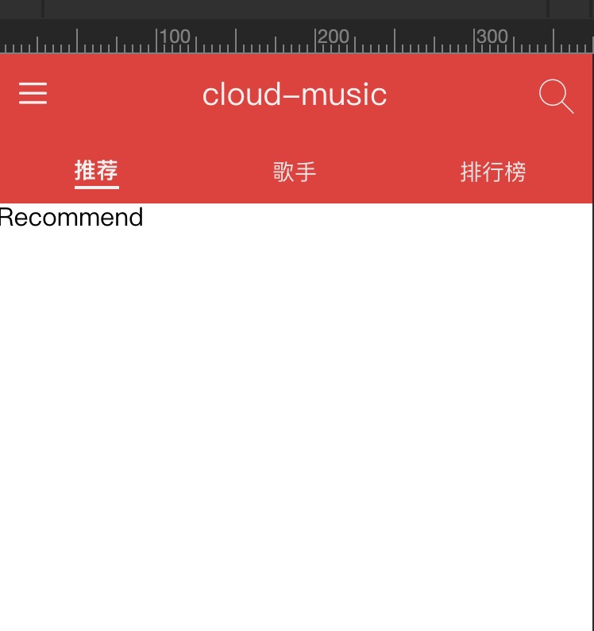

## React Hooks 

hooks出现很久了，之前只是看过文档，没有进行实战，刚好在掘金看到了[react-cloud-music](https://github.com/sanyuan0704/react-cloud-music)的项目, 觉得还不错，就买了下来，学习一下, 加入了自己的理解和书写习惯，巩固和深入学习Hooks。

## react相关练习项目
[React+React-Router+redux+styled-components简单仿简书](https://github.com/hbbaly/react-practice/tree/master/demo/jianshu)

[React入门](https://github.com/hbbaly/react-practice)

[React-Router入门](https://github.com/hbbaly/react-practice/tree/master/router)

[redux简单入门](https://github.com/hbbaly/react-redux)

[styled-components入门](https://github.com/hbbaly/styled-components-learn)

## 安装脚手架

```bash
npx create-react-app cloud-music
```

```bash
npm i
```

### 添加styled-components

[use styled-components](./readme/styled-components.md 'use styled-components')

### 引用iconfont字体图标

[use iconfont](./readme/iconfont.md 'use iconfont')

### 配置路由

[use router-config](./readme/router.md 'use router-config')

### 定义全局样式变量

[global variables](./readme/variables.md 'global variables')

### 编写通用头部样式

[common header](./readme/header.md 'common header')




##  recommend页面编写

[recommend page](./readme/recommend.md 'recommend page')

## 使用better-scroll优化列表体验

[use better-scroll](./readme/bs.md 'use better-scroll')

### forwardRef 使用

`React.forwardRef` 会创建一个React组件，这个组件能够将其接受的 ref 属性转发到其组件树下的另一个组件中。

### useImperativeHandle

```js
useImperativeHandle(ref, createHandle, [deps])
```
`useImperativeHandle` 可以让你在使用 ref 时自定义暴露给父组件的实例值。在大多数情况下，应当避免使用 ref 这样的命令式代码。`useImperativeHandle` 应当与 `forwardRef` 一起使用

## 配置环境变量

```bash
cnpm i -D cross-env
```

```js
// package.json
"scripts": {
    "start": "cross-env NODE_ENV=development node scripts/start.js",
    "build": "cross-env NODE_ENV=production node scripts/build.js",
    "test": "node scripts/test.js"
  },
```

`config`文件夹内新建`default, index, development, production`文件
配置相应的内容并导出

`index.js`

```js
import developConfig  from './development'
import prodConfig from './production'
import defaultConfig from './default'

const configEnv = process.env.NODE_ENV === 'development' ? developConfig : prodConfig
const config = Object.assign(defaultConfig, configEnv)
export default config
```

## 请求数据以及使用redux

### axios简单封装

[use axios](./readme/axios.md 'use axios')

## 跨域问题解决

[resolve kors](./readme/kors.md 'resolve kors')

这样跨域就完成了， **后台接口使用[网易云API](https://github.com/Binaryify/NeteaseCloudMusicApi)下载项目本地运行，记得改端口！！！**

## 添加api

[create api](./readme/api.md 'create api')

## redux

```bash
npm i redux redux-thunk redux-immutable react-redux immutable -S
```

这里如果不熟悉redux可以查看[react-redux](https://github.com/hbbaly/react-redux)


[use redux](./readme/redux.md 'use redux')

这样recommend页面数据完成， 后面页面就这样使用redux
